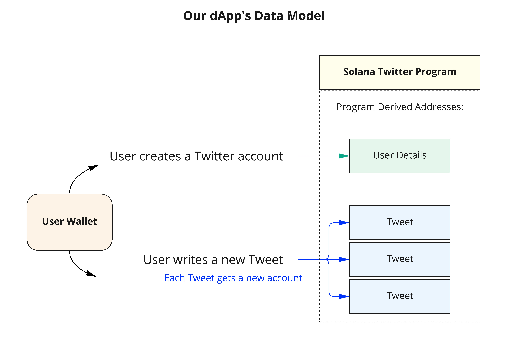
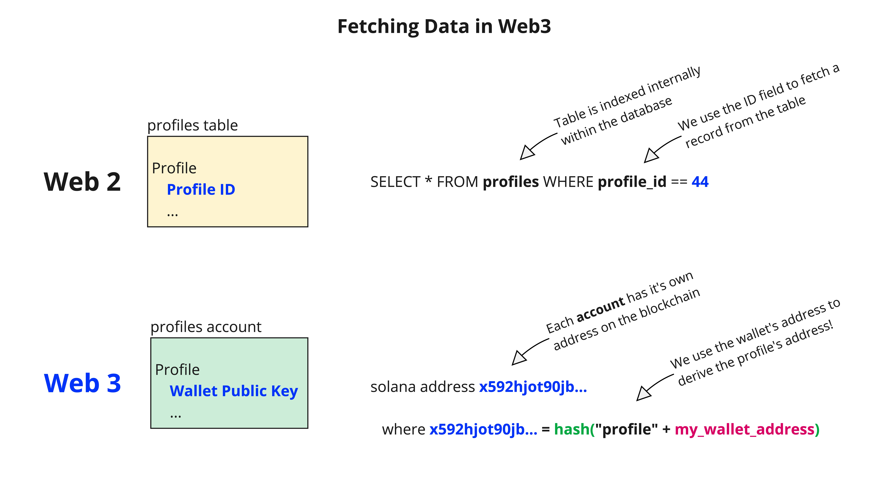
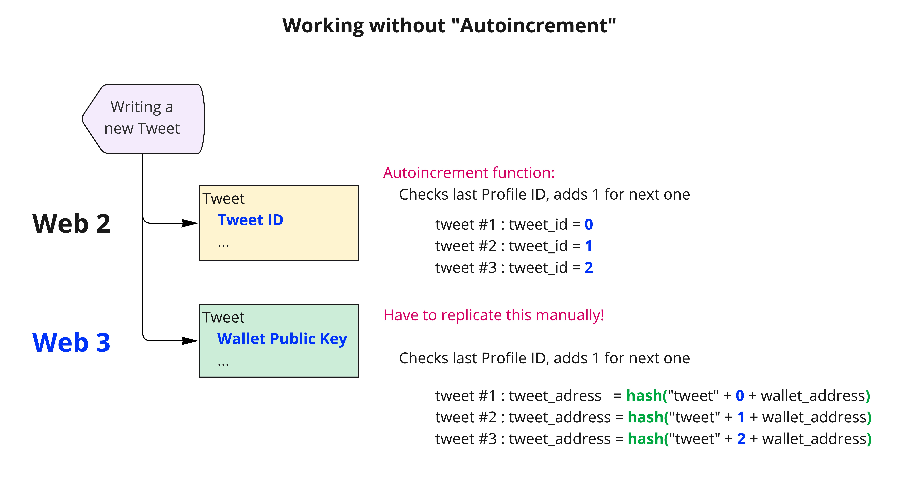

# Solana Twitter

## Project

This project demonstrates how to create a social media app (like Twitter) using Solana's PDAs and on-chain data.   
   
You can find all of the details on how this program works in the [Diagrams](#diagrams) section below.

### Notes:

    * Introduces the ability to mint users tokens based on their earned likes & retweets
    * Demonstrates how to create mints that are PDAs off of the program
    * Demonstrates how to designate the program (via a PDA) as the Mint Authority
    * Demonstrates how to airdrop users tokens without requiring action on their part

## Diagrams

